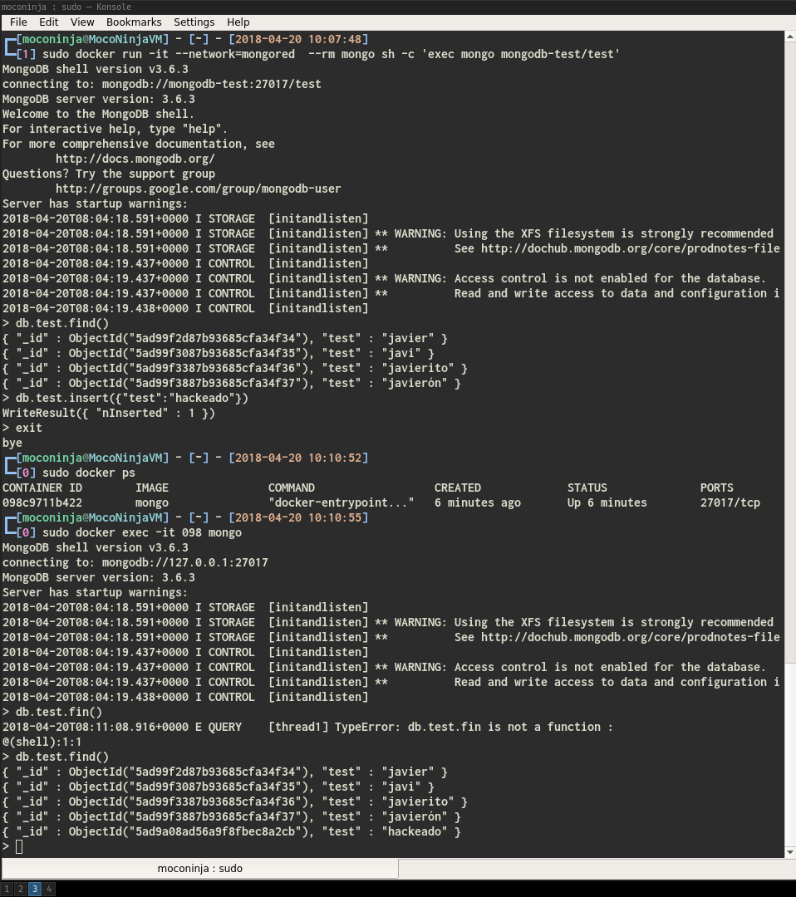

# Investigación de cómo usar un contenedor de MongoDB como cliente

## Introducción

Se requiere usar una instancia de mongo no como servidor de base de datos, sino como cliente. Esto está levemente introducido en la [documentación oficial](https://hub.docker.com/_/mongo/).

## Análisis de la documentación

En primer lugar, debemos tomar como referencia el comando que aparece en la documentación:

```shell
docker run -it --link some-mongo:mongo --rm mongo sh -c 'exec mongo "$MONGO_PORT_27017_TCP_ADDR:$MONGO_PORT_27017_TCP_PORT/test"'
```

Es conveniente analizar el significado de estos parámetros:

* ***--link***: es una opción desfasada para conectar contenedores, ya que actualmente la forma [recomendada](https://stackoverflow.com/questions/41294305/docker-compose-difference-between-network-and-link/41294598#41294598) es usar **docker networks**
* ***--rm***: es una opción que permite que el contenedor se elimine al ser parado
* ***exec mongo***: remplaza la *shell* por *mongo*
* ***sh -c argumento***: fuerza a que sea *sh* lance *argumento* en vez del intérprete por defecto. Este ejemplo se ve mejor ejecutando por ejemplo: ```python -c 'print(2 + 2)```

Así mismo es conveniente analizar el [Dockerfile](https://github.com/docker-library/mongo/blob/58bdba62b65b1d1e1ea5cbde54c1682f120e0676/3.0/Dockerfile) para ver que:

* El ***ENTRYPOINT*** de la imagen es un script llamado *docker-entrypoint.sh*. Bajo un rápida inspección de este script, parece gestionar los argumentos que se le pasan para ejecutar servicios de mongo de forma correcta, evitando problemas que puedan derivar de los argumentos
* El ***CMD*** de la imagen es **mongod**, es decir, que por defecto la base de datos entra como **servidor**

**Con esto podemos aprender que estos parámetros crean un contenedor de docker, que se borra el pararse, conectado a otro mongo y que remplaza la shell por el cliente de mongo con unos parámetros**.

Tambien es interesante conocer los comandos de MongoDB. Para ello, voy a obtender información sobre ellos mediante ```man```:

* ***mongod***:  Como se ve en el manual:

Es decir, es el motor de la base de datos, y es la opción por defecto de la imagen de Mongo, como puede leerse en el [Dockerfile](https://github.com/docker-library/mongo/blob/58bdba62b65b1d1e1ea5cbde54c1682f120e0676/3.0/Dockerfile)

* ***mongo***: Del manual:

>mongo  is  an interactive JavaScript shell interface to MongoDB, which provides a powerful interface for systems administrators as well as a way for developers to test queries and operations directly with the database. mongo also provides a  fully functional  JavaScript  environment  for use with a MongoDB. This document addresses the basic invocation of the mongo shelland an overview of its usage.
mongod  is  the  primary  daemon process for the MongoDB system. It handles data requests, manages data access, and performs background management operations.

Recalcando el siguiente argumento:
>***--host \<hostname>*** \
\
>Specifies the name of the host machine where the mongod or mongos  is  running.  If  this  is  not  specified,  mongo
attempts to connect to a MongoDB process running on the localhost.

Es decir, es el **cliente** de mongo, ya sea de una base *local* o *remota*.

## Ejecución

En las imagenes siguientes puede verse como se crea un contenedor de mongo en el que se introducen datos.

Después de tener estos datos, se crea un contenedor efímero con el cliente, en el cual podemos visualizar los datos introducidos previamente y añadir uno nuevo.

Finalmente al cerrar el cliente y volver a conectarse directamente a la shell del servidor, podemos ver que, en efecto, se visualiza el campo adicional que hemos introducido mediante el cliente en el contenedor aislado.

Los comandos utilizados han sido:

* ```sudo docker network create mongored```: Para crear la red en la que estarán el servidor y el cliente

* ```sudo docker run --rm --name=mongodb-test --network=mongored -d mongo```: Crea un contenedor servidor de Mongo *dettached*, **con el nombre mongodb-test** y en la red anteriormente creada

* ```sudo docker run -it --network=mongored  --rm mongo sh -c 'exec mongo mongodb-test/test'```: Corre en modo *interactivo* un contenedor de mongo que en vez del servidor ejecuta el **cliente**. Notar que como argumento se le pasa la url de conexión en formato **nombredelContenedorServidor**/nombre de la base de datos

\


