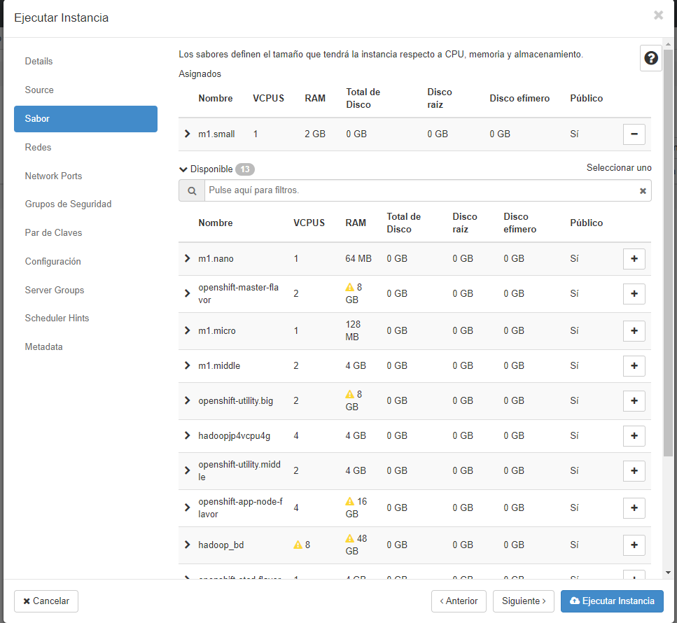

# Tarea de Introducción a Openstack

## Introducción

Se nos encargó la tarea de aprender el funcionamiento básico de Openstack, con el objetivo final de disponer de nuestra propia instancia de una máquina virtual de *CentOS 7* en la que poder correr aplicaciones contenidas en *docker*.

## Metodología

### Portal de Openstack

El primer paso fue loguearnos en el [portal](https://portal.openstack.helix.int/dashboard/auth/login/?next=/dashboard/) de la plataforma con las credenciales que nos fueron asignadas.

### Creación de la red

Una vez dentro, el primer paso consistió en crear la **red** y la  **subred** que albergarían nuestras máquinas virtuales.

La forma de crearlas es muy intuitiva y se puede observar en las siguientes imágenes:


### Creación de la máquina virtual

El proceso de creación de una máquina virtual en Openstack es bastante similar al que se usa en un entorno más cotidiano, como podría ser *VirtualBox*. Conceptos clave de este paso son:

* Imagen: concepto similar al de una *iso*; contiene el sistema operativo a partir del cual deseamos hacer la máquina. En nuestro caso, usamos una **imagen cloud de Centos x86_64**

* Sabor: indica las características que tendrá la máquina; en nuestro caso, hemos usado el sabor **m1.small** que asigna *1 CPU Virtual* y *2 GB de RAM* a nuestra **instancia**

* Volumen: permite persistir datos

Así mismo, no hay que olvidar que debido a que la forma de acceso a la máquina será mediante SSH, hay que generar **un par de claves**, teniendo que guardar el fichero *pem* generado.

Su presentación en la interfaz se observa en las siguientes imágenes: 





### Enrutado y conexión

Para conectar la red de nuestra máquina a la red pública, necesitamos un **router**. Este será el encargado de unir la red pública a nuestra red privada mediante una *interfaz de red*, cuya configuración puede observarse en la siguiente imagen. Notar que la IP del router en la red privada debe ser la de la puerta de enlace de la respectiva red.


Otros factores a tener en cuenta para la apertura de la máquina al exterior son:

* IP Flotante: Es una dirección que permite acceder a nuestra máquina desde la red pública.


* Grupos de seguridad: Por defecto, la conectividad de la máquina es limitada y hay que ir añadiendo excepciones según se vea necesario. En la imagen se ve la configuración necesaria para poder hacer login mediante SSH


El resultado final de todos estos pasos desencadena en una topología de red como la de la siguiente imagen.


## Post-Instalación y Dockerización

Una vez hecho esto, los siguiente pasos ya son análogos a los realizados en cualquier otro entorno de trabajo con Docker.

Algo que sí que hay que destacar es que debido al setup de *CentOS*, el servicio de *Docker* puede ser bloqueado por parte de *SELinux*. Es por ello que hay que proceder a su desactivación.

Una forma sencilla de hacer esto es mediante las siguientes instrucciones de shell:

```shell
sed -i 's/SELINUX=enforcing/SELINUX=disabled/g' /etc/sysconfig/selinux
sed -i 's/SELINUX=enforcing/SELINUX=disabled/g' /etc/selinux/config
```

Al **reiniciar el sistema**, *SELinux* debería haber sido desactivado y podrá inicializarse el servicio de *Docker*.

Además de mi [script de configuración](https://github.com/MocoNinja/DevOpsTraining/blob/master/src/OpenStackTraining/scripting/bash/setupOpenStackCentos.sh), he escrito [este otro](https://github.com/MocoNinja/DevOpsTraining/blob/master/src/OpenStackTraining/scripting/bash/dockerAuto.sh) para iniciar varios contenedores.
